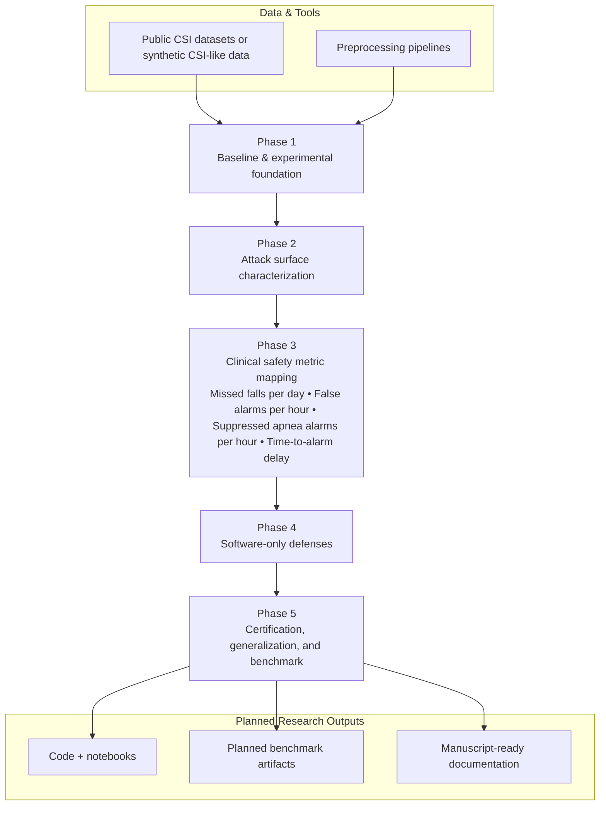

# Secure WiFi CSI Healthcare Sensing — Thesis Research Roadmap

**Disclaimer:** This is a research roadmap for a PhD prototype. It does not claim clinical validation, real patient data use, medical-device readiness, or deployment in clinical care.

## Short project purpose
Provide a structured, reproducible research plan to investigate adversarial risks and robustness for WiFi Channel State Information (CSI) sensing applied to healthcare monitoring (falls, apnea, activity). The goal is a PhD-quality prototype, reproducible benchmark, and technical contributions in attack characterization, robustness methods, and safety-oriented evaluation metrics.

---

## Visual roadmap

---

## Phase-to-thesis-chapter mapping
| Phase | Tentative thesis chapter | Core deliverables |
|---|---:|---|
| Phase 1 — Baseline and experimental foundation | Chapter 3: Experimental setup & baselines | Public dataset list, preprocessing code, baseline model implementations, clean metrics |
| Phase 2 — Attack surface characterization | Chapter 4: Attack taxonomies & white-/black-box evaluation | Attack implementations (FGSM, PGD, C&W-style), transfer experiments, physical-layer framing notes |
| Phase 3 — Clinical safety metric mapping | Chapter 5: Safety-oriented evaluation | Defined clinical-style metrics (missed events/day, false alarms/hour, TTA), mapping from model errors to clinical impact |
| Phase 4 — Software-only defenses | Chapter 6: Robustness methods | Adversarial training experiments, randomized smoothing evaluations, trade-off analysis |
| Phase 5 — Certification, generalization, benchmark | Chapter 7: Certification & reproducible benchmark | Certified bounds where possible, cross-room/dataset generalization studies, planned benchmark artifacts |

---

## Workstream table (for GitHub Projects / Issues / Milestones)
| Workstream | Project board column | Typical tasks | Relevant expertise |
|---|---|---|---|
| Data & Preprocessing | Backlog / Data | Dataset curation, preprocessing pipelines, synthetic CSI scripts | Researcher / Data eng |
| Baselines & Experiments | In progress | Model training, evaluation, clean metrics | Researcher / ML lead |
| Attacks & Threat Models | In progress | Implement FGSM/PGD/C&W, transfer attacks, physical-layer framing | Security lead / PhD student |
| Safety Metrics & Mapping | Review | Define event-level metrics, simulate clinical rates | Clinical-safety perspective / research evaluation |
| Defenses & Certification | Done / Validation | Adversarial training, smoothing, certification attempts | Robust ML / security research |
| Benchmark Release & Docs | Release | Packaging, reproducibility scripts, license, dataset notes | Research maintainer / documentation |

---

## Research outputs expected from each phase
- Phase 1: Reproducible dataset inventory, preprocessing library, baseline model suite, benchmark scripts.
- Phase 2: A taxonomy of attack surfaces for CSI sensing, reproducible attack implementations, white-box and transfer attack results (no clinical claims).
- Phase 3: Operationalized safety-oriented evaluation metrics and mapping methodology translating ML errors to event-level rates.
- Phase 4: Defense evaluations showing empirical robustness and clean-vs-robust tradeoffs; code to reproduce results.
- Phase 5: Certified-robustness analysis where applicable, cross-domain generalization study, and a reproducible public benchmark release.

---

## How this roadmap supports thesis, job hunting, and startup/collaboration goals
- Thesis: Provides clear chapter structure, reproducible experiments, and avenues for theoretical and empirical contributions.
- Job hunting / Recruiters: Demonstrates expertise in ML robustness, wireless sensing, and applied safety metrics with reproducible artifacts and clear deliverables.
- Future research collaboration: Produces reproducible prototype code, planned benchmark artifacts, and documented threat models suitable for research partnerships or technology transfer (non-clinical prototype).

---

## Links to related repo folders
- [notebooks](../notebooks/)
- [docs](../docs/)
- [datasets](../datasets/)
- [literature](../literature/)
- [results](../results/)

---

## Placeholder links to future files (in this folder)
- [literature_map.md](literature_map.md)
- [dataset_tracking.md](dataset_tracking.md)
- [experiment_tracker.md](experiment_tracker.md)
- [research_to_prototype.md](research_to_prototype.md)

---

## Notes & constraints
- This roadmap is explicitly experimental and research-oriented. It does not claim clinical validation or readiness for deployment. All datasets used must be public or synthetic, and ethical data-use policies must be followed.

---

_Last updated: (planned) — add date when first updated in repo._
